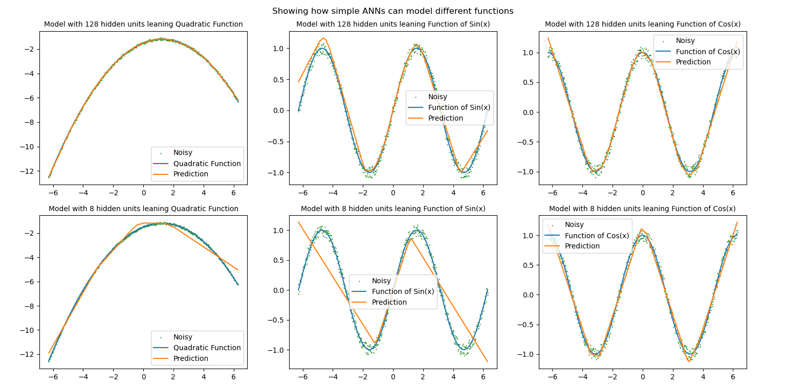

# Neural Network Function Approximation

This project contains a simple Python script that trains neural networks on three different target functions:

- **Quadratic**
- **Sine**
- **Cosine**

The script explores how changing the number of model weights affects a network’s ability to generalise. It visualises:

- The **true functions**
- A **scatter plot** of the training data points (noise added to the true function)
- The **neural network predictions** for each model size

These plots make it easy to compare how network capacity influences learning and overfitting.



## Requirements
- Python 3.x
- PyTorch
- NumPy
- Matplotlib

## Usage
Run the script:

```bash
python Demonstrations.py
